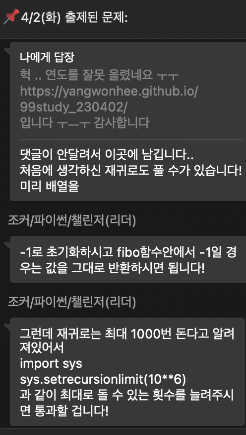

## 프로그래머스 코딩테스트 문제
👉 [피보나치 수 문제 링크](https://school.programmers.co.kr/learn/courses/30/lessons/12945)


<br>
<br>

## 🌱 전체 코드
```py
def solution(n):
    rend = {}
    for i in range(n):
        if i == 1:
            rend[i] = 1
        elif i == 0:
            rend[i] = 0
        if i not in rend.keys():
            rend[i] = rend[i-1] + rend[i-2]
    answer = (rend[n-1] + rend[n-2]) % 1234567
    return answer

```

## 💬 오늘의 회고

- 어떤 문제가 있었고, 나는 어떤 시도를 했는지:
당연하다는 듯이 재귀함수로 풀고 오류가 났다! 시간초과 때문에 정의한 fibo 함수 안에 나눗셈을 넣고 별 짓을 다 했는데 계속 오류가 나서 .. 그냥 딕셔너리로 풀어볼까? 싶어서 일단 그냥 짜봤는데 바로 성공할 줄은 ...!
원래 오늘 논문 좀 쓰고 오후에 문제풀이 하려고 했는데, 연구실 출근해서 머리 비울겸 푸니까 괜찮은 것 같다! 그래서 논문은 언제 쓰지 ...

<br>

- 추가 (오후 11:12 ..)

처음으로 스터디 톡방에 TIL 올려봤는데 피드백 해주셔서 감동받았다 ... 
<B>중간 카톡내용에 -1일 경우가 아니라 -1이 아닐 경우라고 정정해주셨다.</B>

그래서 다시 풀어본 재귀 코드!!!

```py
import sys
sys.setrecursionlimit(10**6)
global li

def fibo(n):
    global li
    if li[n] == -1:
        li[n] = fibo(n-1) % 1234567 + fibo(n-2) % 1234567
    return li[n]

def solution(n):
    global li
    li = [-1] * (n+1)
    li[0] = 0
    li[1] = 1
    answer = fibo(n) % 1234567
    return answer
```
놀랍게도 재귀로도 정답이 나올 수 있었다!! 
<br>

- 내일 학습할 것은 무엇인지:
내일도 프로그래머스 한 문제 풀고 TIL 작성하기, 자소서 정리하기!

<br>
<br>


```toc

```
