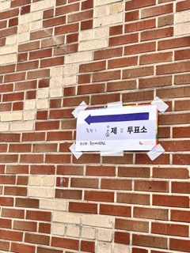

## 프로그래머스 코딩테스트 문제
👉 [이진변환 반복하기 문제 링크](https://school.programmers.co.kr/learn/courses/30/lessons/70129)


<br>
<br>

## 🌱 전체 코드
```py
def trans(s, cnt):
    li = [x for x in s if x == '1']
    new_cnt = len(s) - len(li) + cnt
    bi = bin(len(li))[2:]
    return bi, new_cnt

def solution(s):
    cnt = 0
    num = 0
    while len(s) > 1:
        num += 1
        s, cnt = trans(s, cnt)
    answer = [num, cnt]
    return answer
```

## 💬 오늘의 회고

- 어떤 문제가 있었고, 나는 어떤 시도를 했는지:
아주 아주 깔끔하게 거의 한방에 풀었다. 비기너 문제 일지도 ... ? 


- 다른 사람의 풀이: 

프로그래머스 다른 사람 풀이 중 '안강민' 님의 코드를 보았다. 제일 많은 좋아요 수는 아니지만, 낭만있게 이진수 구하는 함수를 직접 구현하였다. 

이건 사담인데, 재작년 초 부터 연구실에서 파이프라인을 하나 만들기 시작했다. 작년 여름 쯔음 완성이 되었는데 그 동안 함수 파라미터, 함수 이름, 함수가 없어짐 .. 등의 다양한 이슈가 있었다. 파이프라인 수정해서 고쳐쓰는 건 나의 몫 ... ^^ 가끔 파라미터 늘려줘서 설정 값의 다양성을 확보하는 건 좋았으나 .. 함수 이름이랑 파라미터 이름 자꾸 수정하지 마세요 🥲 그리고 패키지 이름도 바뀌고, 패키지 내의 함수를 다른 곳으로 이동을 한다던가 .. 🤬ㅎㅎ

아무튼 이런 일이 있어서, 함수를 사용할 때도 그냥 대충 파라미터만 알고 무작정 사용한다기보다는, 함수 내의 코드를 이해할 수 있는 것이 중요하고 또 직접 구현할 줄도 알면 베스트 라는 생각이 들었다. 

갑자기 정말 쓰잘데기 없는 이야기를 하게 되었는데, 결론은 남의 코드를 이해하는 능력이 중요하다는 뜻이다.


👉 [다른 사람의 풀이 링크](https://school.programmers.co.kr/learn/courses/30/lessons/70129/solution_groups?language=python3)

```py
# 이진수로 바꾸는 함수 구현
def makeBin(len):
    result = []
    while len != 0:
        # 만약 홀수라면 1을 넣고 2로 나눠주기
        if len % 2 == 1:
            result.append("1")
            len = (len-1)/2
        # 짝수면 0을 넣고 2로 나누기
        else:
            result.append("0")
            len = len/2
    return result

def solution(s):
    answer = []
    x = s[:]
    zero_count = 0
    itr_count = 0
    # 1을 받으면 둘다 0으로 출력.
    if x == "1":
        answer = [0, 0]
    else:
        # 1이 될 때까지 계속 돌리기
        while x != "1":
            temp = []
            itr_count += 1
            # 1빼고 지워야하니까 1만 추가하고, 0이나오면 zero_count 세기
            for i in x:
                if i == "1":
                    temp.append("1")
                else:
                    zero_count += 1
            # 이진수로 나온 리스트를 하나로 합치기. 예) ['1', '1', '0', '1'] -> '1101' 
            x = "".join(makeBin(len(temp)))
    answer = [itr_count, zero_count]
    return answer
```

<br>

- 오늘 배운 것: 

.. 조금 자기? 오늘 늦잠잤더니 머리가 무겁다. (근데 머리는 잘 돌아감.) 근데 내일 논문 심사 신청 마지막 날이라 초안 내야돼서 발등에 불났음.


<br>

- 오늘의 사담:
휴일이라고 알람도 안맞추고 냅다 잠들었는데 눈 떠보니 2시더라..

바로 밥 먹고 울 집 댕댕이랑 엄마랑 투표소가서 투표도 하고, 카페오자마자 오늘의 문제 풀었다. 
근데 오늘 문제가 쉬워서 넘 금방 풀어버린 .. ~ 
매일 TIL하면서 느낀건데 문제만 풀고 끝내는게 아니라, 풀고 나서 다른 사람의 코드보며 새로운 아이디어를 얻는게 더 많은 공부가 되는 것 같다. 

처음 .. 머신러닝 공부할 때도 교수님 코드 무작정 보면서 모든 함수를 구글링했던 기억이 ... (냅다 사막에 던져진 나.)

그러므로 오늘부터는 다른 사람의 코드 리뷰까지 하는게 어떨까 라는 생각을 했다. 스터디원과의 코드 공유도 재미있을 것 같은데, 같이 하실 분이 계실지 ..? 우선 오늘은 프로그래머스의 다른 사람들의 코드 중 하나를 리뷰하는 것으로 시작해봤다. 


<br>
<br>


```toc

```
