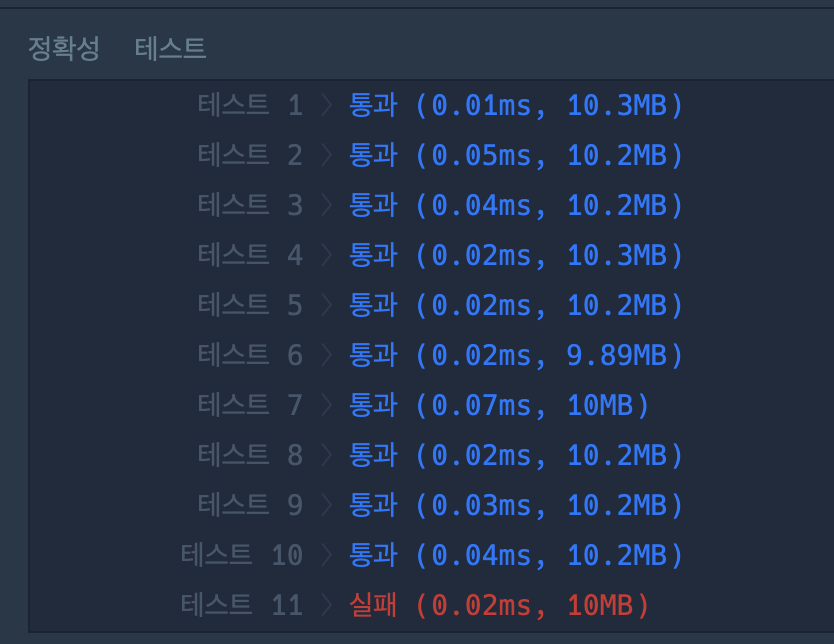

## 프로그래머스 코딩테스트 문제
👉 [기능개발 문제 링크](https://school.programmers.co.kr/learn/courses/30/lessons/42586)


<br>
<br>

## 🌱 전체 코드

### 틀린 코드 입니다.  . ... . .
```py
from collections import deque
def solution(progresses, speeds):
    queue = deque()
    for i in range(len(progresses)):
        time = (100 - progresses[i]) // speeds [i]
        queue.append(time)
        
    answer = []
    print(queue)

    cnt = 1
    a = queue.popleft()
    while 1:
        if not queue:
            answer.append(cnt)
            break
        elif max(a, queue[0]) != a:
            answer.append(cnt)
            a = queue.popleft()
            cnt = 1
        else:
            cnt += 1
            queue.popleft()
            
    return answer
```

## 💬 오늘의 회고

- 어떤 문제가 있었고, 나는 어떤 시도를 했는지: 🤦‍♀️

도대체 ... 뭐가 문제인데 ...? 
자바 미들러 분들한테 슬쩍 가서 여쭤봤는데 아직 푸는 중이라고 하셔서 .. ㅜㅜ
처음에 며칠 걸리는지 세는 deque 구성은 바로 했는데, while문 부터 막혔다. 계속 deque range 초과 떠서 .. if문 넣고 이것 저것 하다보니 복잡해지고, while문은 무한 루프로 바꾸고, 그 안에서 break하게 만들었다. 

그니까 결론은 처음 계획한 거랑 완전 다르게 흘러갔다는 뜻 ..
그리고 테스트 11을 결국 못 풀었다는 뜻 ..

그래서 .. 다른 사람의 풀이를 볼 수도 없었다는 뜻 ..

그럼 이만 .....


<!-- - 다른 사람의 풀이:  -->

<!-- 

👉 [다른 사람의 풀이 링크](https://school.programmers.co.kr/learn/courses/30/lessons/70129/solution_groups?language=python3) -->

<!-- ```py
``` -->

<br>

<!-- - 오늘 배운 것:  -->


<br>

- 오늘의 사담: 🥲

매번 스터디를 집 앞 카페에서 하는데 오늘 컨디션 난조로 .. 집에서 했다. 집에서 하니까 뭔가 집중이 잘 안되는 느낌 ...

그리고 일단 논문 리젝 ^^ 이라 해야되나 .. 그래서 금일 심신미약으로 인해 .. 컨디션 난조가 왔습니다 ... 

일단 어제 새벽 3시반까지 카페에서 논문 최종수정 한 논문이 오늘 대차게 까이고 욕 먹고 .. ~ 

그래서 스터디 슬쩍 쉴까했는데 .. 내일 안과가서 검진때문에 혹시 모니터를 못 볼 가능성이 있어서 꾸역꾸역 참여했다. 

<br>
<br>


```toc

```
