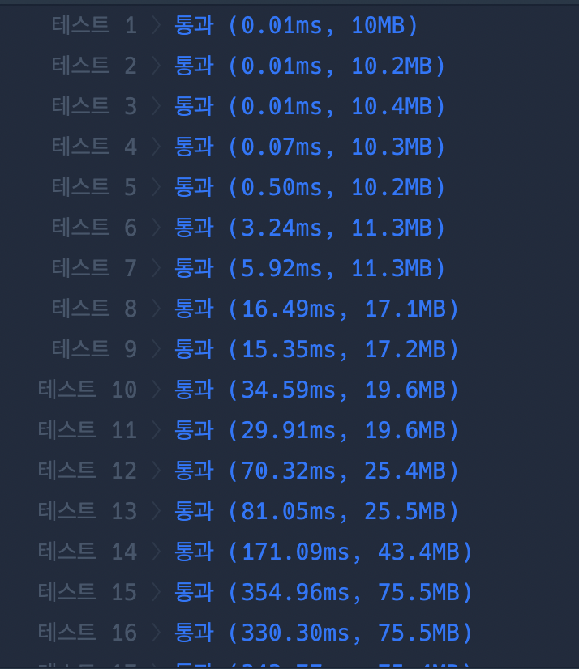
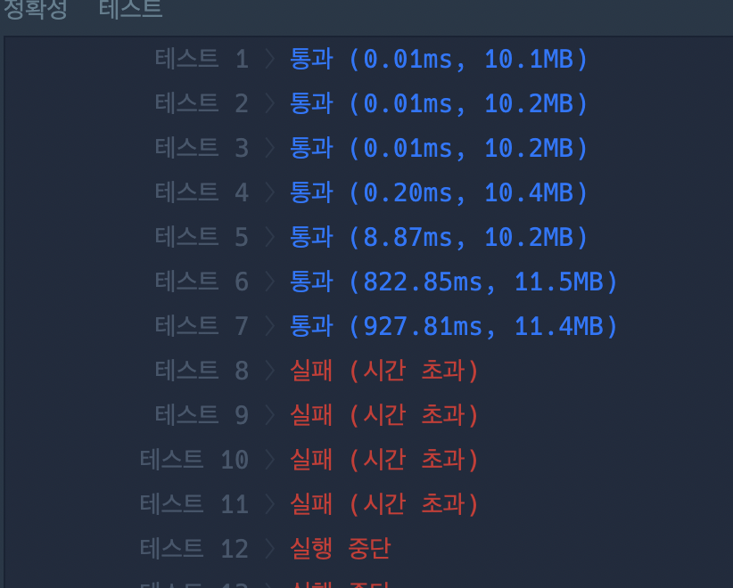

## 프로그래머스 코딩테스트 문제
👉 [뒤에 있는 큰 수 찾기 문제 링크](https://school.programmers.co.kr/learn/courses/30/lessons/154539)


<br>
<br>

## 🌱 전체 코드

### 정답 코드
```py
def solution(numbers):
    stack = []
    answer = [-1] * len(numbers)
    for i in range(len(numbers)):
        while stack and numbers[stack[-1]] < numbers[i]:
            answer[stack.pop()] = numbers[i]
        stack.append(i)
    
    return answer
```



## 💬 오늘의 회고

- 어떤 문제가 있었고, 나는 어떤 시도를 했는지: 🤦‍♀️

처음에는 내가 좋아하는 큐로 돌렸는데 시간초과가 났다. 왠지 술술 짜여진다 싶었는데 ... 

 >제한사항
>> 4 ≤ numbers의 길이 ≤ 1,000,000
>> 1 ≤ numbers[i] ≤ 1,000,000

제한사항 확인 꼭 하기 .. ㅠㅠ
deque로 돌리면 다음의 큰 값을 찾을 때까지 계속 돌려야된다. 
그리고 `[9, 1, 5, 3, 6, 2]` 만 봐도, 5에서 6까지 두 번의 반복을 해야되는데, 3의 순서에서도 한번 또 같은 것을 반복한다. 그럼 3번의 손해가 생긴다. . .. 

### 틀린 코드🥲
```py
from collections import deque
def find_max(a, queue):
    for i in queue:
        if a >= i:
            continue
        else:
            return i
    return -1
    
def solution(numbers):
    numbers = deque(numbers)
    answer = []
    
    while len(numbers) > 1:
        a = numbers.popleft()
        if max(numbers) == a:
            answer.append(-1)
        else:
            answer.append(find_max(a, numbers))
    answer.append(-1)
    return answer
```



<!-- - 다른 사람의 풀이:  -->

<!-- 

👉 [다른 사람의 풀이 링크](https://school.programmers.co.kr/learn/courses/30/lessons/70129/solution_groups?language=python3) -->

<!-- ```py
``` -->

<br>

- 오늘 배운 것: `스택 사용하기`


<br>

- 오늘의 사담: 

오늘 이력서 특강을 들었는데, 내가 여태 쓴 서류는 서류도 아니었다는 것을 느꼈다. 다른 사람들의 이력서를 직접 구경해보니, 정말 깔끔하고 정리가 잘 되어있어서 놀랐다. <del>그 와중에 단점 피드백 하시는 거에 더 놀라버린</del> 

이력서도 몇 번 넣은 상태에서 보니까 충격먹었는데, 다음에 서류 붙고나서 면접 스터디할 때도 충격먹을 것 같다. 덜 놀라기 위해 CS 지식도 탄탄하게 공부를 해야하는데 ...
화이팅 .. !!


<br>
<br>


```toc

```
