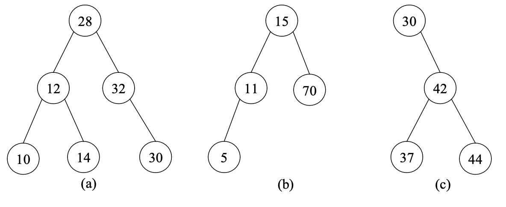

## 👊 이진 탐색 트리 개념

<br/>

이진 탐색 트리는 임의의 키를 가진 원소를 삽입, 삭제, 검색 등을 하기에 효과적인 자료구조이다. 모든 연산은 `key` (node) 값을 기초로 실행하며, 2개 이상의 같은 key값을 허용하지 않는다.
<br/>
이진 트리는 공백이 아닐 시에 다음과 같은 조건들을 만족한다.
- 모든 노드는 상이한 키를 가짐.
- 왼쪽 서브 트리 노드들의 키는 루트의 키보다 작아야 하고, 오른쪽 서브 트리 노드들의 키는 루트의 키보다 커야 한다.

<br/>
예시:


(a): 이진 탐색 트리가 아님 / (b): 이진 탐색 트리 / (c): 이진 탐색 트리 

<br/><br/>

### **이진 탐색 트리에서의 탐색 (순환적 기술)** <br/>
*키 값이 x인 원소를 탐색할 때* <br/>
이진 탐색 트리가 공백이면, 실패로 탐색이 끝난다. 시작은 루트에서부터 시작을 하고, 루트의 키 값이 x일때, 탐색이 성공하여 종료된다. 키값 x가 루트의 키값보다 작을 시, 루트의 왼쪽 서브트리만 탐색한다. 키값 x가 루트의 키값보다 클 때, 루트의 오른쪽 서브트리만 탐색한다.


<br/>


### ✍️ 탐색 알고리즘


```c
searchBST(B, x){
    p = B;
    if(p == null) return null;      // x가 없음
    if(p.key == x) return p;        // 탐색 성공
    if(p.key < x) return searchBST(p.right, x);     // 오른쪽 서브트리 탐색
    else return searchBST(p.right, x);          // 왼쪽 서브트리 탐색
}
```
<br/><br/>

### **이진 탐색 트리에서의 삽입** <br/>
*키 값이 x인 새로운 원소를 삽입할 때* <br/>
x를 키 값으로 가진 원소가 있는지를 탐색한다. 탐색이 실패하면, 탐색이 종료 된 지점에 원소를 삽입한다.

### ✍️ 삽입 알고리즘
```c
insertBST(b, x){
    p = B;
    do{
        if(x = p.key) return;
        q <- p;
        if(x < p.key) p = p -> left;
        else p = p -> right;
    }while(p != null)

    anode = getNode();
    anode -> key = x;
    anode -> right = null;
    anode -> left = null;
    if(B == null) B = newNode;
    else if(x < q.key) q -> left = newNode;
    else q-> right = newNode;
    return;
}
```
<br/><br/>

### **이진 탐색 트리에서의 삭제** <br/>
*삭제하려는 원소의 키 값이 주어졌을 때* <br/>
x를 키 값으로 가진 원소가 있는지를 탐색한다. 탐색이 실패하면, 탐색이 종료 된 지점에 원소를 삽입한다.

<br/><br/>

## 4. 💻 실행화면


**위 코드를 참조하시면서 궁금하신 점이 있다면 아래 `댓글`로 남겨주세요!👇**

<script src="https://utteranc.es/client.js"
        repo="yangwonhee/blog-comments"
        issue-term="pathname"
        label="😈"
        theme="github-light"
        crossorigin="anonymous"
        async>
</script>


```toc

```
