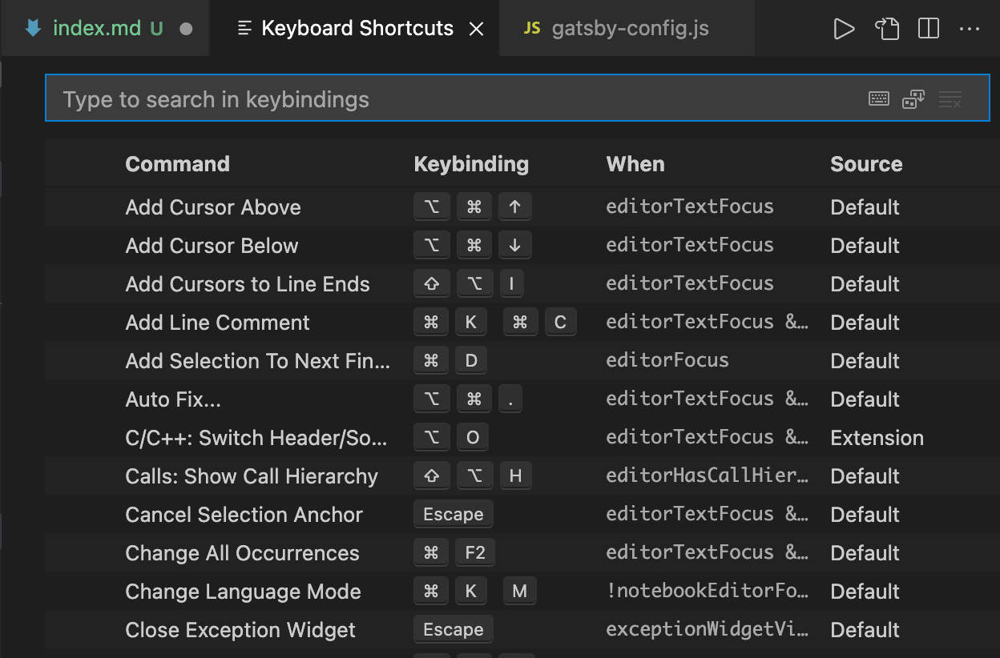
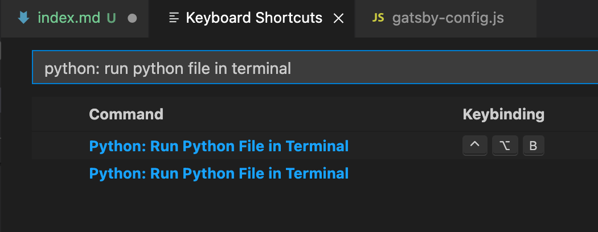
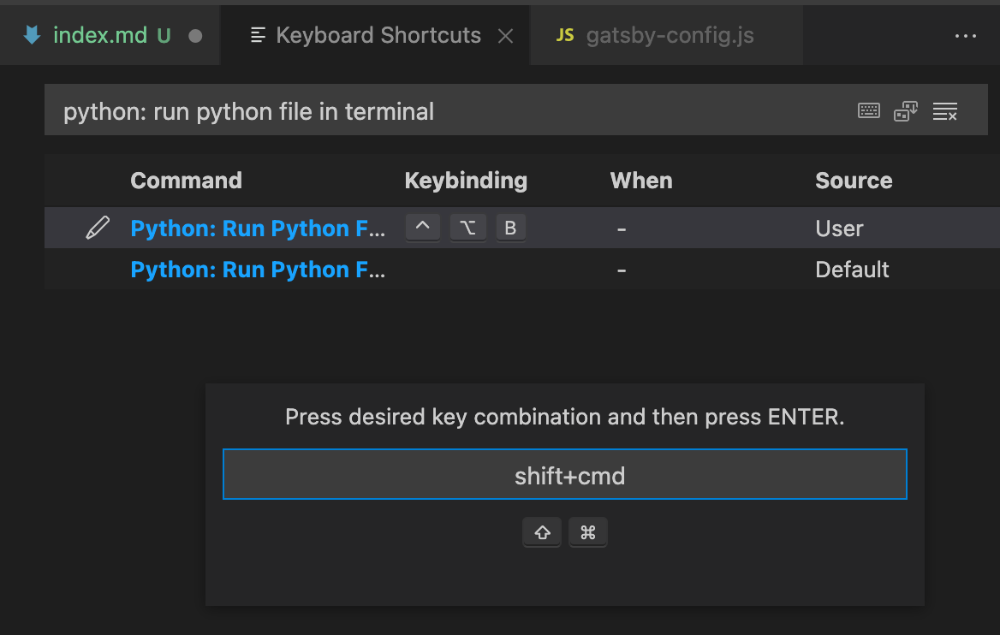

주변에 (몇 없는 🙂) 취업한 사람들에게 들은 이야기 중 대부분이 "c언어 공부 .. 그 정도면 됐으니 다른 언어로 갈아타" 라는 ... 말씀에 ... 처음 코딩을 할 때 배웠던 python을 제대로 해보자! 라는 생각이 들었다. 

그래서 vscode로 파이썬을 하려는데 이게 웬 .. 오류 ..? 인가 싶어 보니 terminal에서 compile이 python이 아닌 code runner(c 사용)로 돌아가는 것이었던 .. 것이었던.. 것이었다... 코드 실행 단축키 문제였으므로 단축키를 바꾸는 글입니다.

서론이 기네요 😅

<br/>

## ⌨️ mac 단축키 : `command` + `k` + `s` 
윈도우 단축키 : `control` + `k` + `s`



위와 같이 keyboard shortcuts가 뜨는데, vscode의 단축키를 설정할 수 있는 창이다.
<br/><br/>

## ⌨️ Type to search in keybindings 칸에 `python: run python file in terminal` 을 검색한다.



위와 같이 검색이 되는데, 일치하는 검색어(파란 글씨)를 클릭하면 글자 왼쪽에 연필모양의 버튼이 뜬다. 


<br/>


## ⌨️ 원하는 단축키로 설정 (최대한 다른 키와 겹치지 않도록)



연필모양의 버튼을 누르면 위 사진과 같이, keybinding을 입력하는 칸이 나온다. 이때 본인이 사용하기 편한 단축키를 입력해서 사용하면 된다. 


**이 글의 `Reference` 👇**

[https://junha1125.tistory.com/37](https://junha1125.tistory.com/37 "reference")


```toc

```