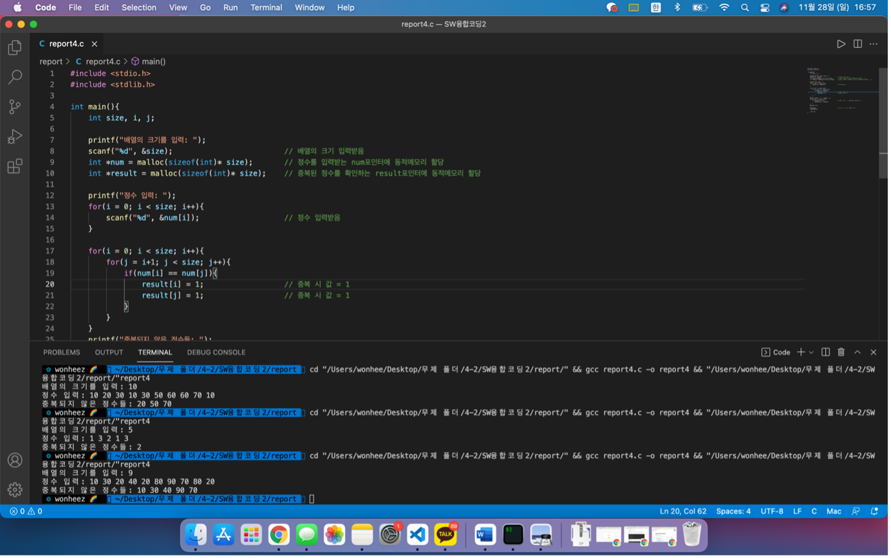

## 1. 👊 문제

<br/>

 동적 메모리 할당을 사용하여 정수형 배열을 생성하고, 그 배열의 크기만큼 정수를 입력받는다. 이때 같은 정수가 1번 이상 입력될 수 있으며, 중복되지 않은 정수들만을 출력하는 프로그램을 작성하시오. 3가지 다른 데이터에 대해 프로그램을 실행하시오.


```bash
배열의 크기를 입력: 10
정수 입력:10 20 30 10 30 50 60 60 70 10
출력: 중복되지 않은 정수들 :20 50 70
```


## 2. 🤔 코드 설명


```bash
#include <stdio.h>
#include <stdlib.h>

int main(){
    int size, i, j;

    printf("배열의 크기를 입력: ");
    scanf("%d", &size);                         // 배열의 크기 입력받음
    int *num = malloc(sizeof(int)* size);       // 정수를 입력받는 num포인터에 동적메모리 할당
    int *result = malloc(sizeof(int)* size);    // 중복된 정수를 확인하는 result포인터에 동적메모리 할당

    printf("정수 입력: ");
    for(i = 0; i < size; i++){
        scanf("%d", &num[i]);                   // 정수 입력받음
    }

    for(i = 0; i < size; i++){
        for(j = i+1; j < size; j++){
            if(num[i] == num[j]){
                result[i] = 1;                  // 중복 시 값 = 1
                result[j] = 1;                  // 중복 시 값 = 1
            }
        }
    }
    printf("중복되지 않은 정수들: ");
    for(i = 0; i < size; i++){
        if(result[i] != 1){                     // 중복 된 값은 1, 중복 아닌 정수 값은 0
            printf("%d ", num[i]);
        }
    }
    printf("\n");

    free(num);                                  // 동적으로 할당한 메모리 해제
    free(result);

    return 0;
}
```

## 3. 😎 코드 전체

주석이 없는 전체 코드입니다.

```bash
#include <stdio.h>
#include <stdlib.h>

int main(){
    int size, i, j;

    printf("배열의 크기를 입력: ");
    scanf("%d", &size);
    int *num = malloc(sizeof(int)* size);
    int *result = malloc(sizeof(int)* size); 

    printf("정수 입력: ");
    for(i = 0; i < size; i++){
        scanf("%d", &num[i]);             
    }

    for(i = 0; i < size; i++){
        for(j = i+1; j < size; j++){
            if(num[i] == num[j]){
                result[i] = 1;     
                result[j] = 1;         
            }
        }
    }
    printf("중복되지 않은 정수들: ");
    for(i = 0; i < size; i++){
        if(result[i] != 1){               
            printf("%d ", num[i]);
        }
    }
    printf("\n");

    free(num);       
    free(result);

    return 0;
}
```

## 4. 💻 실행화면




**위 코드를 참조하시면서 궁금하신 점이 있다면 아래 `댓글`로 남겨주세요!👇**

<script src="https://utteranc.es/client.js"
        repo="yangwonhee/blog-comments"
        issue-term="pathname"
        label="😈"
        theme="github-light"
        crossorigin="anonymous"
        async>
</script>


```toc

```
