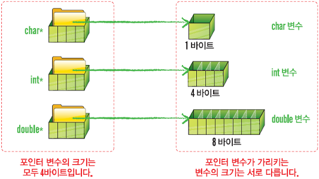
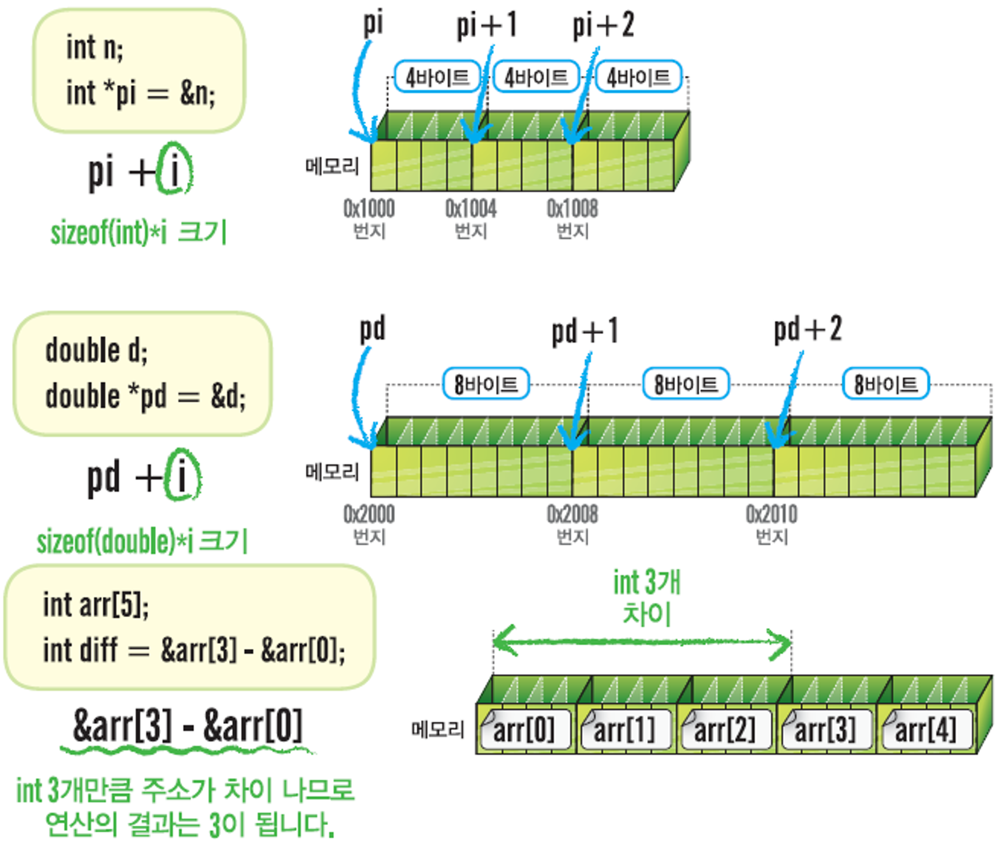

## 👊 포인터의 기본

<br/>

* 포인터 변수란?
    * 다른 변수의 주소를 저장하는 변수
    * 포인터 변수는 주소를 저장하기 위해서 주소 크기만큼 메모리를 사용하는데, 주소의 크기는 시스템에 따라 다름.
    * 포인터 변수는 다른 변수를 가리키는 변수이다.
        * 포인터는 주소를 이용해서 특정 변수에 접근할 수 있도록 도와준다.
    * 포인터 변수를 선언할 때는 데이터 형을 먼저 쓰고, `*`을 쓴 다음, 변수 이름을 적어준다.

```c
char *pc; // char 변수의 주소를 저장하는 포인터 변수
int *pi; // int 변수의 주소를 저장하는 포인터 변수
short *ps; // short 변수의 주소를 저장하는 포인터 변수
float *pf; // float 변수의 주소를 저장하는 포인터 변수
double* pd; // double 변수의 주소를 저장하는 포인터 변수
```
* 포인터의 선언 
    * 포인터 변수는 포인터 형에 관계 없이 항상 크기가 4바이트이다. (32비트 플랫폼을 기준으로 함.)



<br/><br/>

* 포인터의 사용
    * 주소 구하기 연산자
        * 변수 이름 앞에 &를 사용하면 변수의 주소를 구할 수 있다.
        * 반드시 변수 이름 앞에만 사용할 수 있으며, 상수나 수식에는 사용할 수 없다.
        * &연산자로 구한 주소를 포인터 변수에 대입할 때 형이 일치하는 경우에만 대입하도록 주의해야 한다.

```c
int x;
int *p;
p = &x;             // x의 주소를 구해서 포인터 변수 p에 대입.
```
```c
p = &10;            // 상수의 주소를 구할 수 없으므로 컴파일 에러.
p = &(x + 10);      // 수식의 주소를 구할 수 없으므로 컴파일 에러.
```
```c
int x;
char *pc = &x;      // 포인터형이 일치하지 않으므로 컴파일 경고.
```


<br/><br/>

* 간접 참조 연산자
    * 포인터 변수 이름 앞에 `*`를 사용하면 포인터 변수가 가리키는 변수에 접근할 수 있다.
    * *연산자는 반드시 포인터 변수 앞에만 사용할 수 있으며, 포인터 변수가 아닌 일반 변수 앞에 사용해서는 안된다.

```c
int x;
int *p;
p = &x;         // p에 x의 주소를 보관.
*p = 10;        // p가 가리키는 변수, 즉 x에 10을 대입.
printf("%d", *p); // p가 가리키는 변수의 값을 출력한다.
```
```c
int x;
*x = 10;        // 포인터가 아닌 경우에 *연산자를 사용할 수 없으므로 컴파일 에러.
```


<br/>

> 예제
```c
#include <stdio.h>

int main(void){
    int x;
    int *p;

    p = &x;
    *p = 10;

    printf("*p = %d\n", *p);
    printf("x = %d\n", x);

    printf("p = %p\n", p);
    printf("&x = %p\n", &x);

    printf("&p = %p\n", &p);

    return 0;
}
```
> 출력값
```c
*p = 10
x = 10
p = 0x16bb872c8
&x = 0x16bb872c8
&p = 0x16bb872c0
```
<br/><br/>

## ⚠️ 포인터 사용 시 주의사항 <br/>
* 포인터 변수의 데이터형은 반드시 포인터 변수가 가리키는 변수의 데이터 형과 일치해야 한다.
```c
short a;
int *p = &a;        // compile warning!
*p = 10;
```
* 포인터 변수가 가리키는 변수의 데이터 형과 일치하는 포인터 형으로 선언하고 사용해야 한다.


<br/>

* 선언 시 초기화를 하지 않으면 쓰레기 값을 가진다.
    * 잘못된 메모리에 접근하므로 실행 에러 발생.
    * 포인터 변수는 초기화 후에 사용하는 것이 좋음.
```c
int *p;     // p는 초기화되지 않았으므로 쓰레기 값을 가진다.
*p = 10;    // 실행 에러
```

* 널 포인터
    * 0으로 초기화 된 포인터
    * 아무것도 가리키지 않는다는 의미
```c
int *p = NULL;      // p를 널 포인터로 초기화 한다.
if(p != NULL)       // p가 널 포인터가 아닌지 확인 후에 사용한다.
    *p = 10;
```

## ➕ 포인터의 연산
* 포인터와 +,- 연산
    * 포인터 변수에 정수 n을 더하거나 빼면 '포인터가 가리키는 데이터 형 x n' 만큼 주소를 더하거나 뺀 값이 만들어진다.




**위 내용을 참조하시면서 궁금하신 점이 있다면 아래 `댓글`로 남겨주세요!👇**

<script src="https://utteranc.es/client.js"
        repo="yangwonhee/blog-comments"
        issue-term="pathname"
        label="😈"
        theme="github-light"
        crossorigin="anonymous"
        async>
</script>


```toc

```
