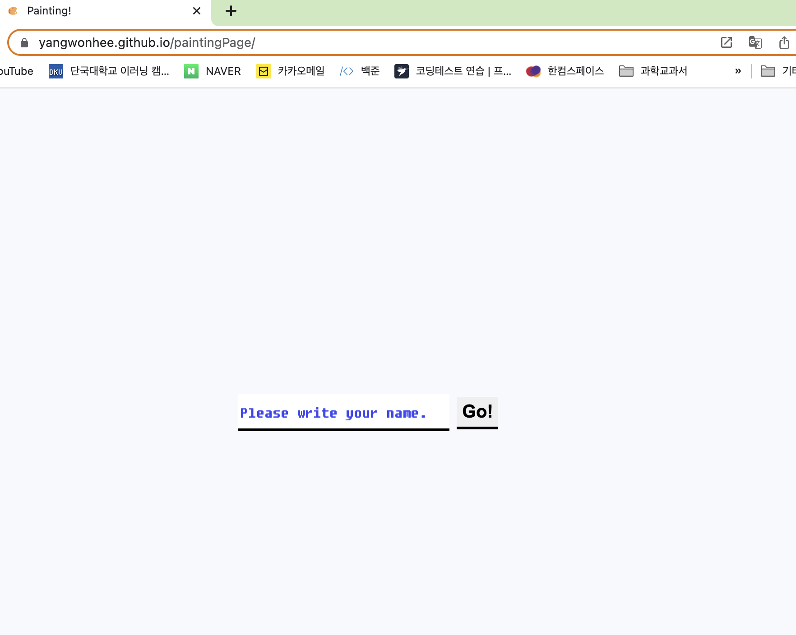
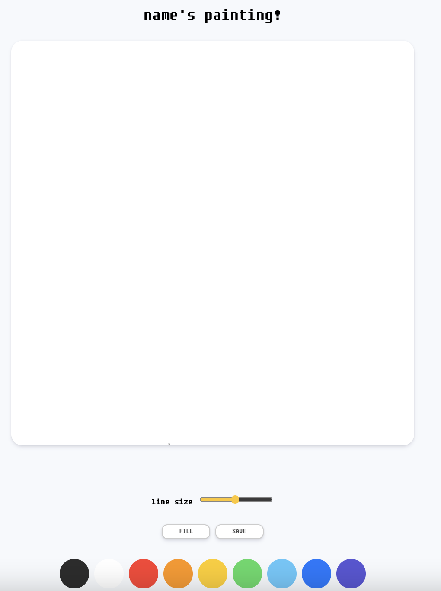
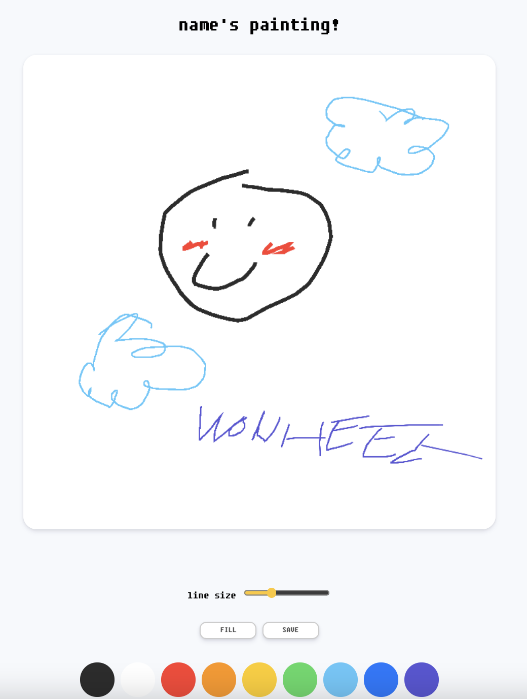
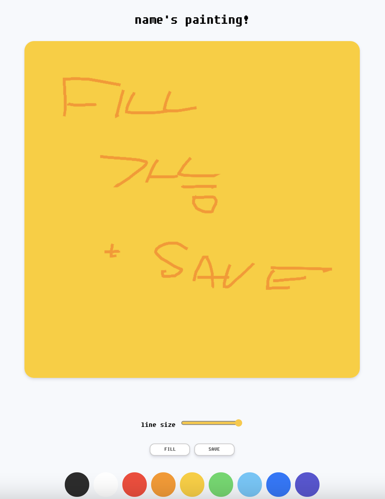
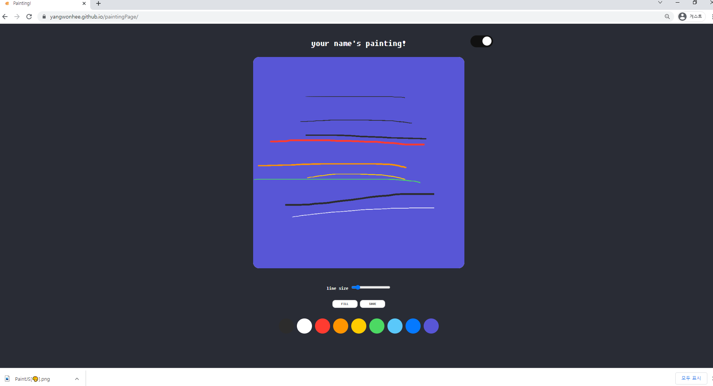

👉👉 [그림판 바로가기](https://yangwonhee.github.io/paintingPage/) 👈👈

## 🤔 계기

처음 개발을 시작하면서는 백엔드에 관심이 생겼지만, 결국 프론트엔드와 백엔드 둘다 기초적인 개념과 지식이 바탕이 되어야 한다는 것을 깨달았다. (아닐지도?)
그렇게 생전 접해본 적 없는 자바스크립트에 대한 호기심이 생겼고, 배움을 통해 직접 내 손으로 작은 결과물을 내고 싶었다. (사실 그냥 만들어보고 싶었다는게 학계의 점심.)

근데 확실히 뭘 만들면서 내가 원하는 것들을 직접 구현하다보니 무엇을 어디서 어떻게 활용해야하는지 느낌이 왔다. (느낌만..?)

<br/>

## ✨ 지원 기능

🖤 다크모드 가능
🎨 그림 저장 가능
🖌 여러 색상 선택 가능
👩‍🎨 색 채우기 가능
🖍 펜 굵기 선택 가능
🍇 이름 입력 후 사용하는 기능 구현

<br/>
<br/>

## 🎨 결과물 미리보기

- localStorge를 통해 이름을 받을 수 있다.
  

- 이름을 입력하면 ㅇㅇ's painting! 이라고 상단에 적힌다.
  

- 그림판 붓의 굵기를 조절 할 수 있다.
  

- 색 채우기도 가능하고, 버튼을 통해 그림을 저장할 수 있다.
  

- 다크모드 또한 지원한다.
  

<br>
<br>

## 💬 아쉬운 점

우선, 새로고침이 될 때마다 localStorge에 이름은 남아있기에 이름은 그대로지만, 그림이 날라간다는 것이다. 이건 주의사항으로 페이지에 써두어야하거나, 새로고침을 해도 그림이 날라가지 않으면서 추가적으로 그림초기화 버튼을 넣어야 할 것 같다.

두 번째로는, 일부 기기의 크롬에서 다크모드 토글이 구현되지 않는다는 것. (내 윈도우 컴퓨터에서는 토글이 잘 보이고 실행되지만, 내 맥북에서는 토글이 체크박스로 나타나고 다크모드도 되지 않는다.)

세 번째로는, 다크모드도 localStorge에 저장되게 해서 새로고침을 해도 그대로 다크모드가 적용이 되어있으면 좋을 것 같다는 점이다.

<br>
<br>

## ✔️ 추가로 구현하고 싶은 사항들

사실 메모장에 틈틈히 떠오를 때 마다 적어두긴 했는데, 언제쯤 다 업데이트 할 수 있을지는 의문이다. 또 새로운 것을 만들고 싶어졌기 때문에 ...

- [ ] 그림판의 크기를 사용자가 설정할 수 있도록 구현해보기
- [x] 이름 입력 후 그림판 나오게
- [x] 그림판 다크모드 토글 추가
- [ ] filling 응용해서 사각형, 원 그리기
- [ ] 초기화 버튼
- [ ] 되돌리기 버튼 + 그림 초기화 버튼

<br>
<br>

👉 [github에서 코드 살펴보기](https://github.com/yangwonhee/paintingPage)

```toc

```
