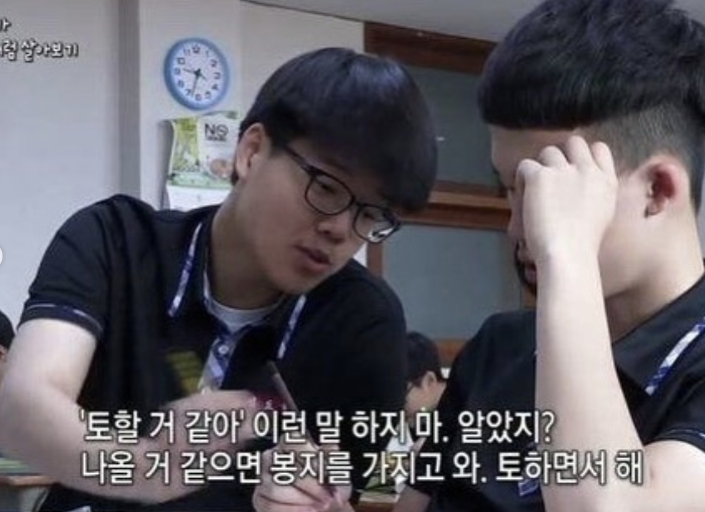
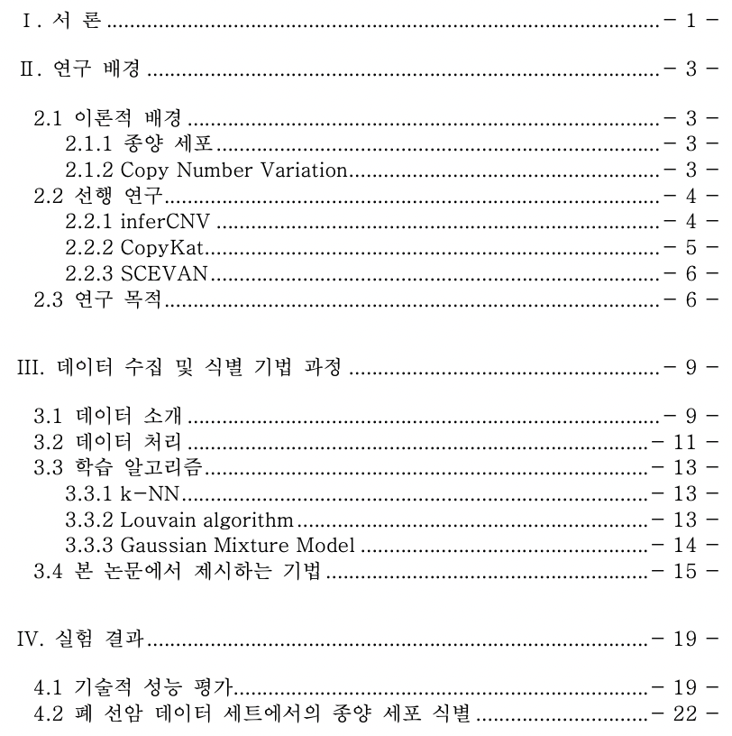
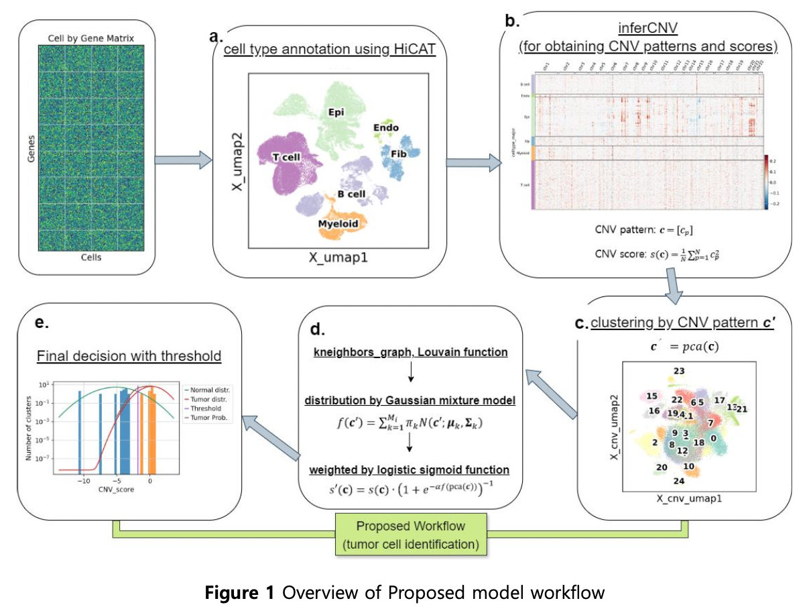
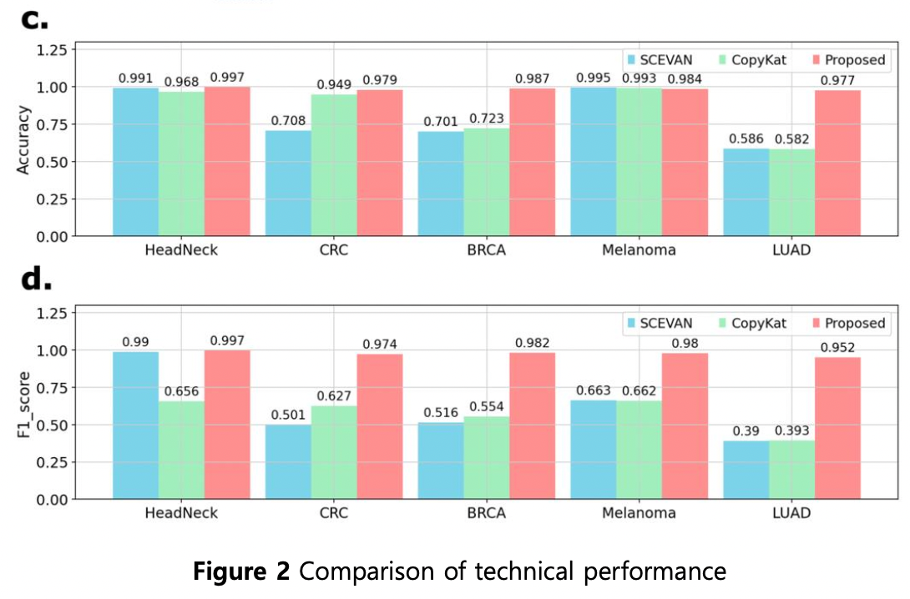
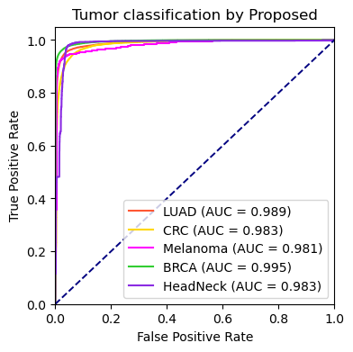
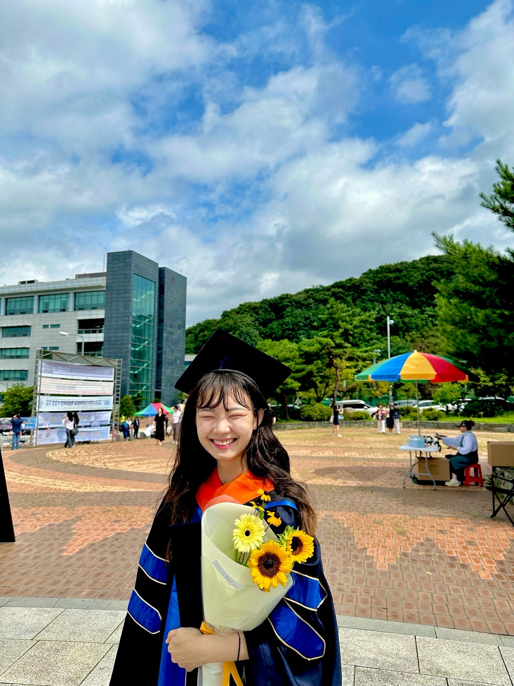

# 기계학습 기반 종양 세포 식별 방법에 관한 연구


## 1. 개요

처음 졸업 논문에 대한 방향은 대장염 연구에 이어 크론병을 연구하는 방향으로 진행하려고 했다. 

2023년 3월 입학 후 10월까지는 크론병에 관한 내용과 데이터를 수집, 정리하고 있었는데… 이런 저런 이유들(병원 교수님 컨택 실패, 머신러닝에 대한 관심 등) 으로 졸업 논문 주제를 바꾸게 되었다.

원래 연구실에서 진행하고 있던 프로젝트이기도 했고(저널에 내려고 했음), 생물 관련한 쪽보다는 머신러닝에 관심이 너무너무 많아서!! ```머신러닝에 중점을 둔 주제```를 택하게 되었다. 

연구실에 들어온게 2021년 11월 경이고, 이 프로젝트가 실제로 시작된 시기는 **2022년 4월**이다. (사실상 장기 플젝) 연구실에서 하고있는 다른 연구과제들이 많아서 아주 천천히 진행되고 있었다…… ~~사실 미룬거임... 미룬이가 되,~~
<br>
<br>

## 2. 일정

졸업 논문 주제 변경 후, 일정이 타이트하게 진행되었다. 타이트한 만큼 마무리 과정이 험난했다.. ~~특히 디펜스(1차 논문심사)에서 엄청 까였다..~~

큰 틀로 보자면,

> 2023년 11월에 주제 변경 → 2024년 1월 중순 최종 모델 지정 → 2024년 2월 논문 작성 시작 → 2024년 4월 초안 제출 → 2024년 5월 디펜스 → 2024년 7월 논문 제출

이런 방향으로 일정이 진행되었고, 11월부터 2월은 정말 바쁘게 흘러갔다. 아무리 코딩과 머신러닝에 관심이 있다고 한들, 두 달 만에 이해와 적용을 하는 것은 쉽지 않았다. 




- 2023.11: 선행연구 모델 탐색. 
    - 최종적으로 성능 비교분석에 CopyKat, SCEVAN을 사용했지만, 찾아 본 논문과 모델만 7-8개가 된다. 이 부분은 연구실 선배님이 많이 도움을 주셔서 머신러닝 알고리즘에 집중할 수 있었다. **민수오빠 고마워요..**
- 2023.12: 비지도학습의 다양한 알고리즘을 탐색하여 적용. 
    - *연구실에서 진행되던 프로젝트이긴 해서 처음부터 모델을 설계해야 하는 것은 아니었지만, 그래도 나에겐 너무 어려웠다.*
- 2024.01: 최종 모델 지정과 성능 비교를 진행.
- 2024.02 ~ : 논문 작성. 
<br>
<br>

## 3. 기술 스택

<!--  -->

<!-- - 논문 목차
 -->


```python
# 사용 패키지들
import warnings, math, time, copy
import numpy as np
import pandas as pd
import matplotlib.pyplot as plt
from sklearn import cluster, mixture
from sknetwork.clustering import Louvain
from sklearn.decomposition import PCA
from sklearn.neighbors import kneighbors_graph

import anndata
import scanpy as sc
import os 
from sklearn.metrics import precision_score, recall_score, f1_score, accuracy_score, classification_report
import sklearn.metrics as met
from sklearn.metrics import auc, plot_roc_curve, roc_curve, accuracy_score
```

- 모든 개발은 연구실 서버에서 ```anaconda```로 환경 만들고, ```jupyter notebook``` 사용해서 개발을 진행.
- 언어는 ```Python```을 사용했으나, 선행 연구 모델은 모두 ```R```이었음.
- 연구실 내부에서 사용하는 패키지도 있으나, 위에 언급은 하지 않음. ~~못한 걸지도~~

<br>
<br>


## 4. 아키텍처



```Figure a.``` H5AD 형식의 cell by gene Matrix를 입력으로 받으면, 우리 연구실에서 개발한 HiCAT이 세포의 유형을 지정해준다. 세포 유형을 지정하는 건 Major, Minor, Subset 세 가지 타입으로 지정할 수 있는데, 여기선 Minor를 사용한다. Major는 너무 큰 틀로 분류하고, Subset은 너무 작은 틀로 분류해서 세포 유형의 종류가 너무 많아진다.

여기서 지정된 세포 중, T cell, B cell과 같이 epithelial cell(상피 세포)과 거리가 먼 특징을 가진 세포들을 ‘참조 세포’로 지정한다. 종양 세포는 Epithelial cell에서 변형이 일어난 세포이기 때문이다. 

```Figure b.``` 그 결과를 inferCNV라는 툴에 넣고 돌린다. 세포 별 Copy number variation(CNV)를 확인할 수 있는 툴이다. 여기서 CNV pattern, CNV score를 획득할 수 있는데 이 결과값을 활용할 것이다.

```Figure c,d.``` 얻은 CNV pattern으로 <u>PCA, clustering</u>을 진행한다. 이 클러스터링 결과와 참조 세포를 바탕으로 루베인 알고리즘을 통해 정상 세포의 군집을 키워간다. <u>Gaussian Mixture Model(GMM)</u>의 score를 군집의 평균으로 대체하고, <u>logistic sigmoid function</u>으로 weight를 줘서 최종 임계값을 지정한다.
<br>
<br>

## 4-1. 시행착오
PCA와 K-neighbors graph를 활용해 초기 데이터 구조를 설정하고, UMAP으로 고차원 데이터의 패턴을 파악했다. 이후 Louvain 알고리즘을 사용해 군집 간의 관계를 분석하고, GMM을 통해 각 군집의 평균을 추정하여 최종적으로 분류를 진행했다. 


이 과정에서 여러 시행착오가 있었는데, 처음에는 데이터의 고차원성으로 인해 군집 간의 명확한 구분이 어려웠다. 이를 해결하기 위해 먼저 PCA를 사용하여 데이터의 차원을 축소하고, 주요 패턴을 파악하는 데 집중했다. 하지만 이 과정에서도 일부 데이터가 여전히 불분명하게 군집화되어 있어서 추가적으로 UMAP을 활용하여 고차원 데이터의 구조를 더 잘 시각화하고, 군집 간의 거리와 관계를 명확히 파악하려고 했다.


Louvain 알고리즘을 적용했을 때 군집 불균형 문제를 겪었다. 이를 해결하기 위해 GMM을 적용함으로써 군집 내 데이터의 특성을 더 잘 반영할 수 있었고, 최종적으로 Louvain 알고리즘의 결과를 개선할 수 있었다. 

이 외에도 DBSCAN, K-means 등 다양한 알고리즘을 시도하며 각 기법의 특성을 파악하고 최적화할 수 있는 방법을 연구했다. 이러한 방법을 통해 고차원 데이터에서도 높은 성능을 확보할 수 있었으며, 기존 연구 대비 크게 향상된 정확도(0.9848)와 F1 score(0.977)를 달성할 수 있었다. 본 기법으로 학위논문 및 국제 학술대회 포스터 세션 발표를 하였으며, 기법을 사용하여 유방암 연구 과제의 데이터를 바탕으로 국외 SCI급 논문을 게재하기도 했다.


이러한 시행착오와 문제 해결 과정을 통해 데이터의 특성을 이해하고, 적절한 알고리즘을 선택하는 것이 얼마나 중요한지를 배우게 되었다. 


## 5. 성능 비교




논문에서 성능 비교는 ```Precision```, ```Recall```, ```Accuracy```, ```F1 score```으로 진행했고, 4가지 방법 모두 제안한 방법이 가장 우수한 성능으로 나타났다. 좌측 그림 x축은 데이터세트 별로 나누었고, y축은 성능 값이다. 우측 그림은 논문에서는 제외 되었으나, ```ROC curve```로 확인하였을 때, 굉장히 우수한 성능을 보인다는 것을 알 수 있었다. 우측 그림이 논문에서 제외 된 이유는, 다른 선행 연구 기법에서는 ROC 커브를 그릴 수 없어서 성능 비교를 할 수 없었기 때문이다. (score가 result에 안나옴.)
<br>
<br>

## 6. 후기

머신러닝 중에서도 비지도학습의 알고리즘 적용을 통해 더 빠르게 습득할 수 있었다. 이론과 실제 적용은 정말 다르고.. 

<u>직접 해보면서 배우는게 재미있으면서도 머리가 아프면서도 이해하는 데에는 가장 좋다는 것이다. </u>

그리고 기술에 대한 논문은 미리미리 읽어야 겠다는 것… 괜히 ```1일 1논문 리딩``` 얘기가 나오는게 아니다…


2023년 겨울의 나...ㅋㅋㅠ

또, 졸업논문은 입학과 동시에 시작해도 늦는다는 것….. 나는 특히 연계과정으로 한 학기를 미리 했는데, 이게 좋으면서도 안좋다는 것….. 연구 과제 하랴, 논문 쓰랴, 너무너무너무 바쁘다 정말..

정말 중요한건, <u>패키지 명과 변수명은 한번에 예쁘게 잘 만들어야 된다는 것</u>을 알았다.. 절대 두 번 손대게 하면 안된다. 시간 소요 가장 컸던게, 변수명을 바꿔서 여기저기서 오류가 났던 것…? 

AI도 적용해보고, 다양한 결과를 뽑도록 추가 기능도 넣어보고 싶었지만, 시간에 쫓기는 바람에.. 처음부터 이 주제로 했으면 좋았을 텐데 아쉽다.


<br>
<br>

### 🎓 아무튼 졸업!!! 



졸업 후 국외 학술회의 포스터 세션에 accept되었다. 근데 11월 초에 다낭에서 있을 예정이라, 후에 포스팅 예정.

```toc

```
