~~대회 끝나자마자 쓰고 싶었는데, 이런저런 일들로 .. 이제야 올립니다.~~ 
아! 물롱 대회랑 상관 없는 일임.

시작하깨효 ..? (사담 가득 주의)

## 🌏 팀 구성


2024년 6월 쯔음 .. 졸업논문을 마무리하고 여유가 생겨서 그동안 참여해보고 싶었던 해커톤을 찾아보게 되었다. 그동안 눈팅만 해오던 데이콘에서 **새싹해커톤**을 보고 일단 팀 빌딩을 지원해주는 운영사무국의 오픈채팅방에 들어갔다. 참가할지 말지 고민하던 중, 하린님(PM)의 아이디어를 보고 너무 좋은 나머지 무작정 팀에 들어가게 되었다.
<br>
<br>
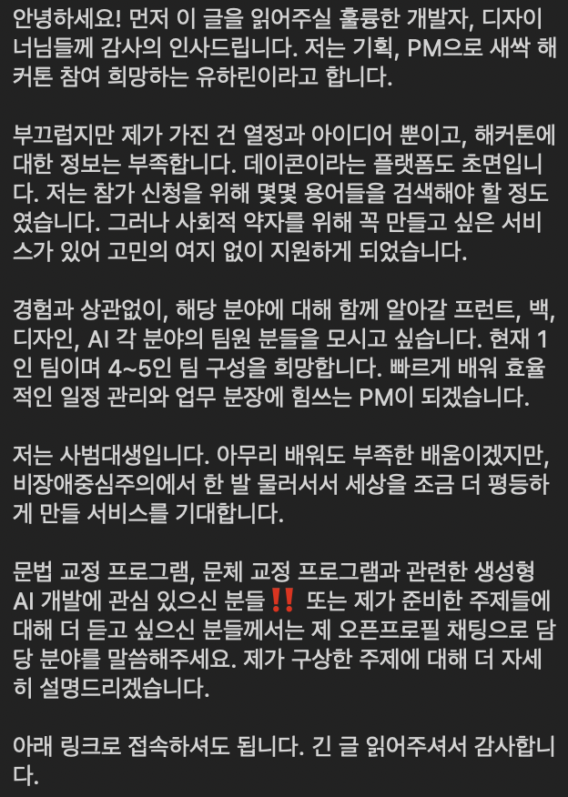

<br>
<br>

많은 아이디어 중, 하린님의 아이디어를 채택한 ~~(내가뭐라고)~~ 이유는 

```생성형 AI를 활용한 사회적 약자 서비스 개발```이 주제였는데 여기에 너무 찰떡인 아이디어 이면서, PM이 개발 쪽에 대해 모른다면 제한 없이 무궁무진한 아이디어를 잘 낼 수 있지 않을까? 라는 생각이 들었기 때문이다. (+ 열정가득한멘트) 

모든 개발자들이 그런건 아니지만, 나는 아이디어를 생각하다보면 <어떤 기술을 쓸지, 이게 구현 가능할지> 부터 생각하게 되는 것 같다보니 저 카톡을 읽으며, 오히려 매력적으로 느껴졌다. 


그렇게 카톡방으로 PM, 백엔드, AI, 디자인, 프론트 까지 5명이 모이게 되었다. 다들 서로 모르는 사이에 대면 미팅을 하려다보니 어색했지만, PM 분이 엄청난 인싸셔서 금방 친해질 수 있었다. 


## ✔️ 예선 준비

처음 나온 아이디어 초안은 이렇다.
<br>
<br>

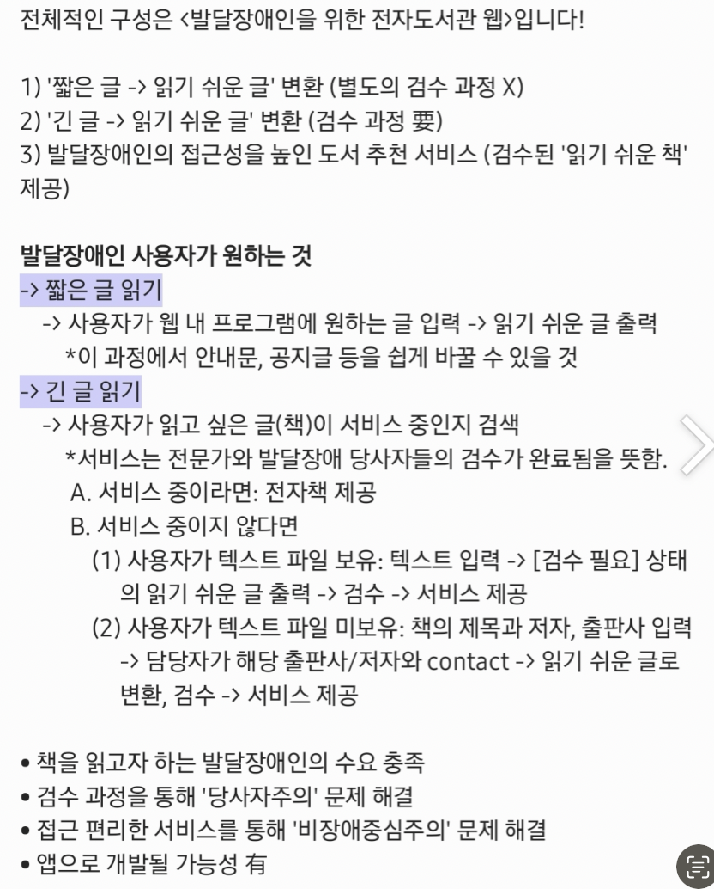

이런 초안으로, 나는 대부분 유정님(백엔드)과 함께 어떤 기술을 쓸지  이야기를 많이 했다. 유정님이 정말 도움을 많이 주셨다. 난 첫 해커톤 참가였는데 유정님께서는 여러 경험이 많으셔서, 해커톤에서는 보통 어떤 기술들을 활용하고, 어떤 식으로 진행하는지 등등 .. 자세히 알려주셔서 너무 감사했다. 고수의 향기가 진하게 났다. ㅎ

<br>
<br>

그리고 나는 사실 데이터 쪽만 자신있다며 팀에 참가를 했는데, 결국 생성형 AI를 사용하려면 담당은 역시 내가 해야하는 것이기에 정말 대회까지 열심히 서치하고 적용하며 준비했던 것 같다... 

<br>
<br>

특히, fine-tuning을 할 때 아쉬웠던 게, 대회 당시에는 gpt-3.5-turbo까지만 지원되어서 gpt-4o를 사용하지 못했다. 

파인튜닝을 하기위한 데이터 수집은, 읽기 쉬운 책 지침에 따라 지피티에서 예시문장을 뽑았다.

<br>
<br>
<br>
<br>

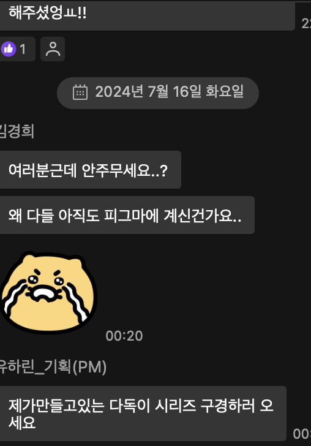

매일 저녁 줌 미팅 후에 피그마 띄워놓고 할일 하던 우리 팀 .. .

<br>
<br>
<br>
<br>

## 😝 본선 진출!!!

#### [🔗 예선 링크](https://dacon.io/competitions/official/236293/codeshare/11384)

<br>


8위로 본선에 진출하게 되었다 !!!! 

이 때부터 본선 후기 엄청 검색해봤다. 안설레는 척 .. 새싹해커톤 후기 일일히 다 본 듯 ㅎㅎ 

_아마 이 글 읽으시는 분들도 2025 새싹해커톤 (하겠지?) 본선 진출하시는 분들이.. 읽고 계시겠죠 영광입니다! 팟팅이에요_

<br>
<br>

## 😚 본선

작년 후기에서 읽은 것처럼 DDP에서 진행되었다. 너무 떨려서 10시부터 시작인데 9시반에 도착했지만 길을 헤매는 바람에 ... 10시에 도착한 팀원들과 같이 들어갔다 ㅎㅎ;

<br>
<br>

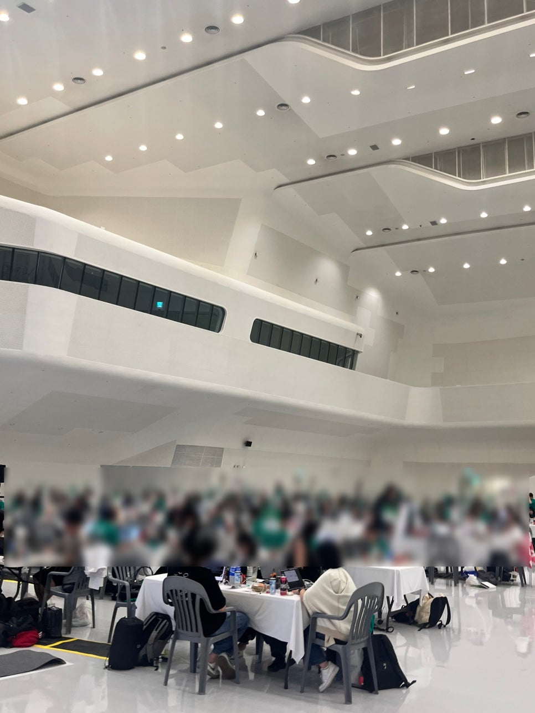

<br>
<br>

대충 현장분위기 .. 생각보다 테이블이 작았다. 5인 같이 쓰기에 넉넉하지는 않았던 .. ㅠㅠ 그래도 멀티탭 준비해주신 것만으로도 감동이었다.

<br>
<br>


<br>
<br>

거의 시작하자마자 점심을 주셨다. 점심은 서브웨이 !!!! 아래도 계속 이어나가겠지만, 밥을 정말 든든히 챙겨주셨다. 간식존에는 대회 내내 먹을 것들이 쌓여있었고, 심지어 계속 새로운 간식이 있었다.
또, 저녁부터? 남녀 각 휴게실이 있다고 들었던거 같은데.. 우리 팀은 바빠서 한숨도 못 자고 휴게실은 구경도 못 했다.

<br>
<br>


점심 먹고 또 간식존 가서 간식 엄청 먹었다. 주최측에서 드라이샴푸, 소독티슈, 세면용품 이것저것 챙겨놓으신거 구경했다. ~~구경만한건 잘못이었다 이때 챙겼어야~~


아래는 우리 팀의 밈 .. 
gpt3.5 fine-tuning 중 epoch를 너무 높였는지 대화 문장들이 다 저렇게 나와버렸다.. 근데 그게 이제 밈이 된,

<br>
<br>

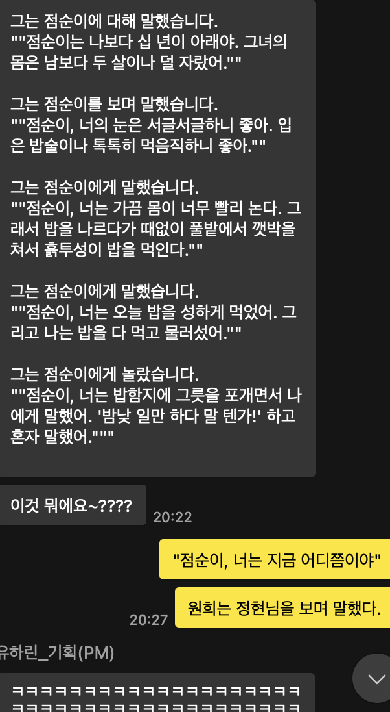

<br>
<br>

정현님(프론트)이 회사 재직 중이셔서 낮에 참가를 못 하셨다 ㅎㅎ 퇴근하고 저녁부터 밤샘을 함께 ^^ .. 하셨다 .. 심지어 다음 날 연차 쓰심 ....ㅎ

<br>
<br>


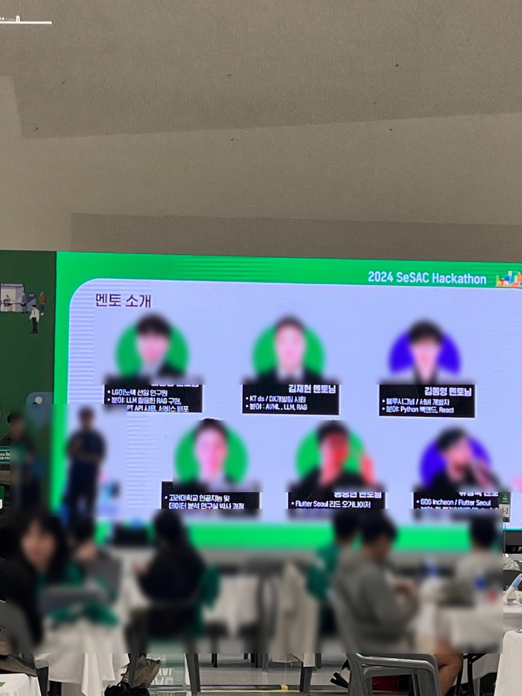

<br>
<br>

아마 저녁먹고 멘토링을 진행했던 것으로 기억한다.. 슬슬 정신이 나갈 무렵, 멘토링 시간이어서 다시 환기하며 집중할 수 있었던 것 같다. 

멘토 분들도 다 현업에서 종사하시는 분들이 오셔서 각 프로젝트에 맞는 조언을 해주셨다. 추가로, 비대면으로 데이콘 게시판으로도 다른 멘토 분들이 계셨다. 우리는 대면 질문만 진행하였다.  

<br>
<br>

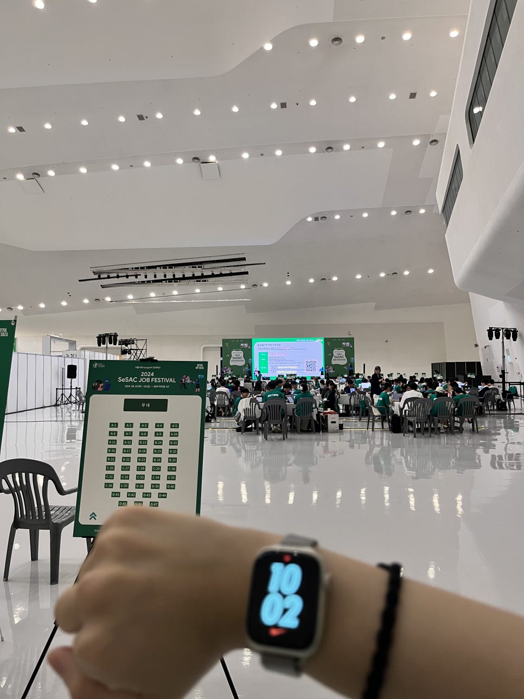

밤 10시 풍경 ㅠㅠ 새벽 1시까지는 거의 모든 팀들이 있었던 것 같고, 새벽 3시쯤부터 자러가거나 사라지기 시작했다. 

<br>
<br>


<br>
<br>


커피를 배달시키려 했는데 정현님이 사오셨따!!!!! 이때까지만 해도 정현님 밤샘 안하고 가시려고 미안하다는 선물이었지만 ..

<br>

그리고 다른 팀에서 포스터 붙여놓은거 ㅎㅎ 보고 ㅎㅎ 우리도 질 수 없다는 생각으로 정현님한테 프린트 해오라고 .. ㅎㅎ 그래서 귀엽게 붙여놓았다. 다른 팀에서 구경하실 때 설명드리기 좋았다!! 추천 .. 

<br>
<br>


<br>

주최측에서 계속 세팅해주셨던 간식들 ... 새벽 간식만 찍었지만 계속 새로운 과자와 간식과 음료수들이 세팅되어있었다. 

<br>


<br>
<br>

새벽 .. 3시? 4시? 쯔음 하린님이랑 둘이 대회장 계단 쪽에서 컵라면 먹었다. 다들 책상에서 엎드려서 주무시거나 벤치 같은 곳에서 주무시길래 컵라면 냄새 안풍기는 구석으로 ..

<br>
<br>

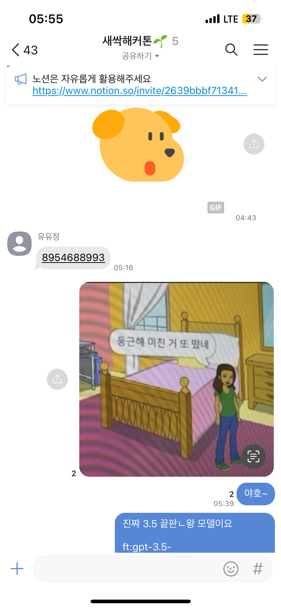

둥근해미친거또떳는데못잔우리..ㅠ

<br>
<br>


마지막 아침.. 8시 제출이었나 ?.. 제출하고 아침먹으니 속이 안좋았다 ㅠㅠ 제출할 때 구글드라이브 오류가 계속 나서 제출 5분 전 쯤 주최측에 급하게 여쭤봐서 usb를 빌려 제출드렸다.

**혹시 이 글을 보시는 2025 해커톤 분들은 usb를 지참해가시길..ㅠ**

<br>
<br>


<br>

본선 끝나고 .. 최종발표까지 한 후, 주신 햄부기 !!!! 아마 인원 맞춰서 준비하신 듯 한데 .. 다들 30시간 밤샘하고 순위 발표 후 가셔서 .. 엄청 많이 남았다... 

그리고 드라이샴푸고 뭐고 다 빈 통이었다 ㅠㅠ 그래서 몰골이 좀 .. 죄송함다.

<br>

<br>

## 🏆 대상 수상

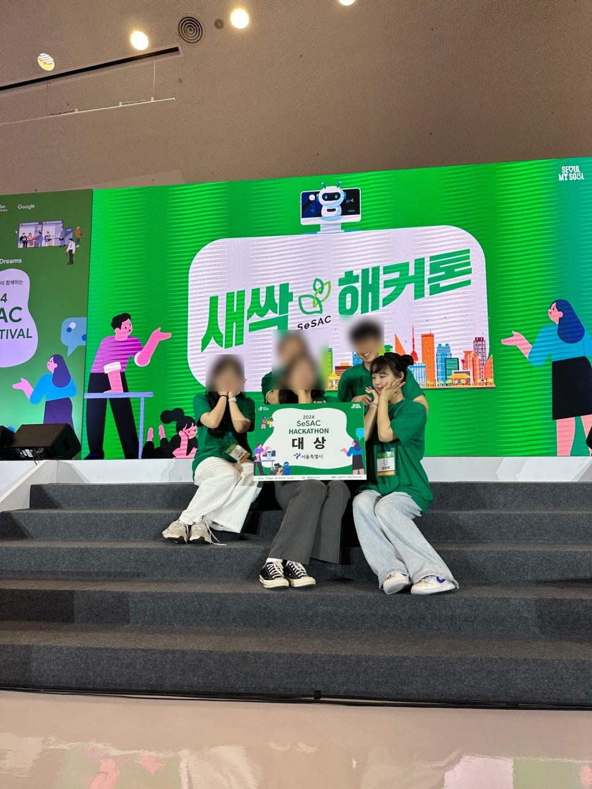

<br>
<br>

아무튼 우리 대상탔다!! 거의 30시간 넘게 밤 샌 몰골이라 .. 많이 추하지만 서울시에서 스트리밍 ~~당~~했던 영상 첨부 .. 
[🔗 서울시 유튜브 시상 영상](https://www.youtube.com/live/PtImA9dVE9o?si=5KH2XJ6HZWmhE0m5)

오세훈 서울시장님 잘 생기셔서 놀랐다 ㅎㅎ 그리고 저 때 너무 신나서 방방 뛰었는데 좀 ~~역겨울지도~~ 봐주셔서 감사합니다 ^^ ,, 

<br>
<br>

아래는 좀 간단하게 정리한 저희 팀 프로젝트를 소개할게용 ㅎㅎ

---

## 💬 해커톤 프로젝트 소개

새싹 해커톤에서 발달장애인을 위한 전자도서관 서비스를 개발하게 되었습니다. 이번 해커톤 주제가 바로 ```생성형 AI로 사회적 약자를 위한 서비스 개발```이었고, 발달장애인들이 쉽게 읽을 수 있는 자료가 많이 부족하다는 문제에서 시작한 프로젝트였습니다.

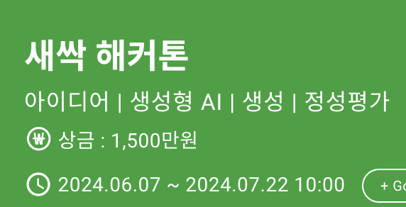

- 프로젝트 명: 발달장애인을 위한 전자도서관
- 해커톤: 2024 새싹 해커톤 - 생성형 AI로 사회적 약자를 위한 서비스 개발
- 예선 기간: 6월 7일 - 7월 22일
- 본선 기간: 8월 1일 - 8월 2일 (무박 2일)

<br>
<br>

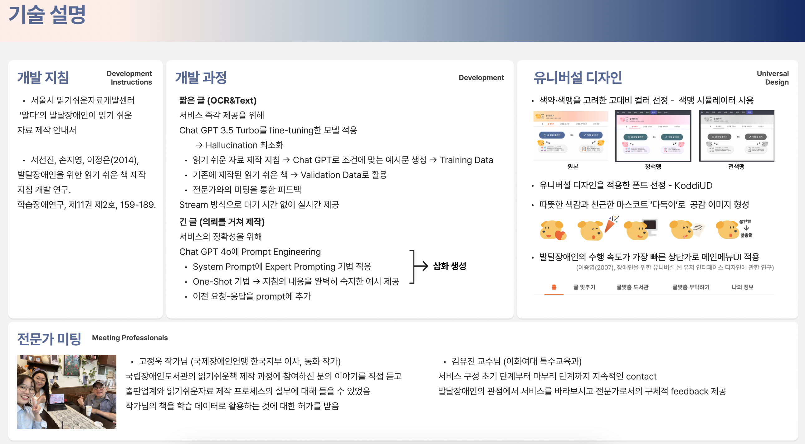


현재 국내에서 발달장애인분들이 읽기 쉬운 책이나 자료는 한정적이지만, 발달장애 인구의 약 ```45%```가 가장 필요로 하는 대체 자료로 읽기 쉬운 책을 선정하였다는 것을 알게되었습니다. 국립장애인도서관의 자료에 따르면, 현재까지 제작된 발달장애인을 위한 읽기 쉬운 책은 총 33권입니다. 저희는 생성형 AI를 활용하여, 쉽게 접근할 수 있는 '발달장애인을 위한 전자도서관'을 만들어보기로 했습니다.

<br>
<br>

- 문제 정의
1. 읽기 쉬운 책의 공급이 왜 부족할까?
2023년, 정부에서 읽기 쉬운 책 만들기 사업에 투자한 예산은 1억 5천만원입니다. 그러나 인건비와 시간 소모로 인해, 실제 제작된 책은 15권입니다. 

2. 읽기 어려운 자료의 장벽을 어떻게 낮출까?
발달장애인분들은 일상적으로 읽는 글 조차도 읽고 이해하는 데 많은 어려움을 겪습니다. 예를 들면, 우리가 매일 타는 엘리베이터의 안내문이나, 공지 같은 글 입니다. 

세상 모든 곳에 정보는 많지만 정작 발달장애를 가진 분들이 읽을 수 있는 자료는 적다 보니, 읽기 쉬운 책과 변환할 수 있는 서비스가 꼭 필요하다고 판단했습니다.
발달장애인분들에게 맞는 쉬운 자료를 제공해 정보 접근성을 높이자는 것이 이번 프로젝트의 목표였습니다.

<br>
<br>


- 문제 해결: 
문제 해결을 위해 ```ChatGPT-3.5-turbo```와 ```ChatGPT-4o``` 모델을 적극 활용했습니다. 각 모델을 적재적소에 투입해 발달장애인에게 맞춤형 자료를 제공할 수 있도록 설계했습니다.


**- ChatGPT-3.5-turbo 모델의 Fine-tuning:**
짧은 텍스트에 대해서는 발달장애인 독자들이 쉽게 이해할 수 있도록 맞춤형 답변을 제공하기 위해 모델을 Fine-tuning 했습니다. Training Loss 0.1962, Eval Accuracy 0.85의 성능을 달성하여, 맞춤형 응답을 생성할 수 있었습니다.


**- ChatGPT-4 모델의 Prompt Engineering:**
긴 텍스트나 복잡한 문서를 처리할 때는 ChatGPT-4 모델을 활용했으며, Prompt Engineering을 통해 모델의 응답 정확도를 높였습니다.
One-shot 기법으로 구체적인 예시를 추가해, 모델이 발달장애인분들에게 적합한 방식으로 내용을 전달할 수 있도록 최적화했습니다.

<br>
<br>

- 프로젝트 결과 및 성과: 대상 (서울시장상)
해커톤 최종 결과에서는 서울시장상 대상을 수상했습니다. 프로젝트 성과가 의미 있는 사회적 기여로 인정받은 부분에서 뿌듯함을 느꼈습니다.

<br>
<br>

- 개인 기여: 모델 설계 및 최적화, 팀워크
이번 프로젝트에서는 제가 모델 설계와 최적화를 주도했으며, 팀원들과 협업하며 전반적인 성과를 함께 이끌어냈습니다. 모든 팀원이 각자의 강점을 발휘하면서, 더 나은 결과를 이끌어낼 수 있었던 점도 기억에 남습니다.

<br>
<br>

### 마무리. 
**AI로 사회적 가치를 만드는 즐거움**

사회적 약자를 위한 서비스를 개발하는 해커톤인 만큼, 다른 팀에서도 여러 아이디어가 나왔고 정말 좋은 서비스가 많았다. 각 팀의 프로젝트가 가진 고유한 아이디어를 보며 우리도 영감을 받았던 것 같다.

대회 내내 우리 팀도 주변 팀들을 보며, "저기는 무슨무슨 주제인데 아이디어가 좋네요", "저기는 어떤 기술을 쓴다는데 신기해요, 저런거 실제로 처음봐요!" 이런 이야기를 하면서 개발을 진행했다. ~~물론 그냥 밈친자들의 헛소리가 반이었다..~~ 

결선 진출했을 때 고생한 24시간에 대한 위로를 받는 느낌과 동시에 놀라움이었다. 또, 해커톤의 의의를 몸소 느꼈다. 사회적 약자를 위한 서비스를 만들겠다는 의지로 모인 다양한 사람들의 열정과 노력을 함께한 것이 영광이었다. 우리의 기술과 아이디어로 만들어진, 누군가에게는 정말 필요한 서비스를 개발하여 세상이 좀 더 따뜻해졌으면 하는 생각이 들었다. 

단순한 해커톤 참여이긴 했지만, 많은 것들을 배우고 경험했다. 이런 경험을 하게 해주신 주최측과 서울시, 구글에 감사함을 느낀다. ~~상을 받았기에 이렇게 생각을 할 수 있는 것 같기도 하고..~~

<u>아무튼 앞으로도 더 많은 사람들이 쉽게 정보를 접하고, 더 많은 선택지를 가질 수 있는 세상을 위해 계속 도전해보고자 한다.</u>

그리고 다양한 해커톤, 공모전에 더 참여해보고 싶다!

<br>
<br>


궁금한 점에 대해서 언제든 댓글 환영입니다 🥰
읽어주셔서 감사합니다!


```toc

```
